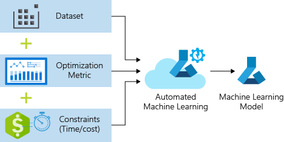
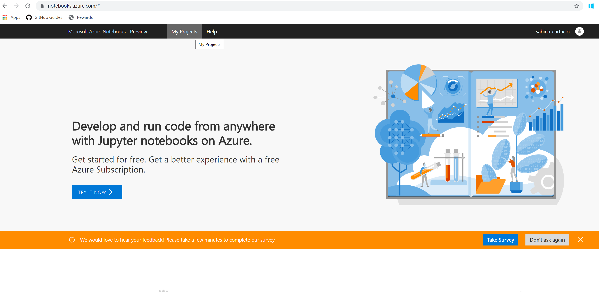
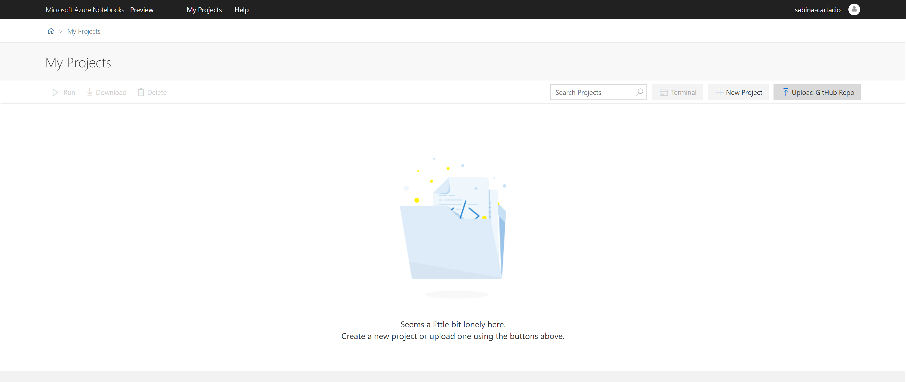
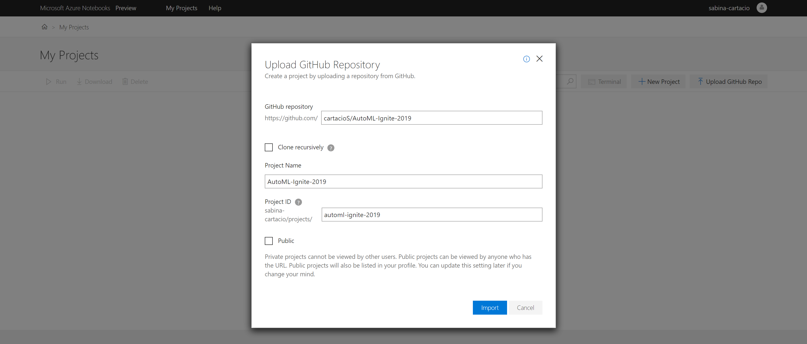

# Ignite Workshop Guide: Automated Machine Learning

## About
In this workshop, you will use automated machine learning in Azure Machine Learning to create a forecasting model to predict NYC energy demand. This process accepts training data and configurations settings, and automatically iterates through combinations of different feature normalization/standardization methods, models, and hyperparameter settings to arrive at the best model.

## Requirements
+ <b>Azure Subscription</b> -
Try [free of paid version](https://azure.microsoft.com/en-us/free/services/machine-learning/) of Azure Machine Learning today.

## Tutorial Steps
+ ### Get Started with [Microsoft Azure Notebooks](www.notebooks.azure.com)

    + Click on the 'My Projects' tab 
    
    + Click on the 'Upload GitHub Repo' button 
    
    + Upload the [Ignite 2019 Workshop Repository](https://github.com/cartacioS/AutoML-Ignite-2019) 
    
    + Click into the 'Jupyter Notebook' folder 
    
    + Open the 'AutoML Forecasting Energy Demand' Jupyter notebook 

+ ### Set up an Azure Machine Learning experiment
1. Import notebook in this same repository, forecasting energy demand, find out if we can disable DNN featurization (15 minutes)
1. Add MAPE score generation
1. Feature importance and explainability (15 minutes) (play around with what-if score)
1. Deployment
1. Inferencing, steal from OJ notebook

## Upgrade to Premium
<link to premium>
